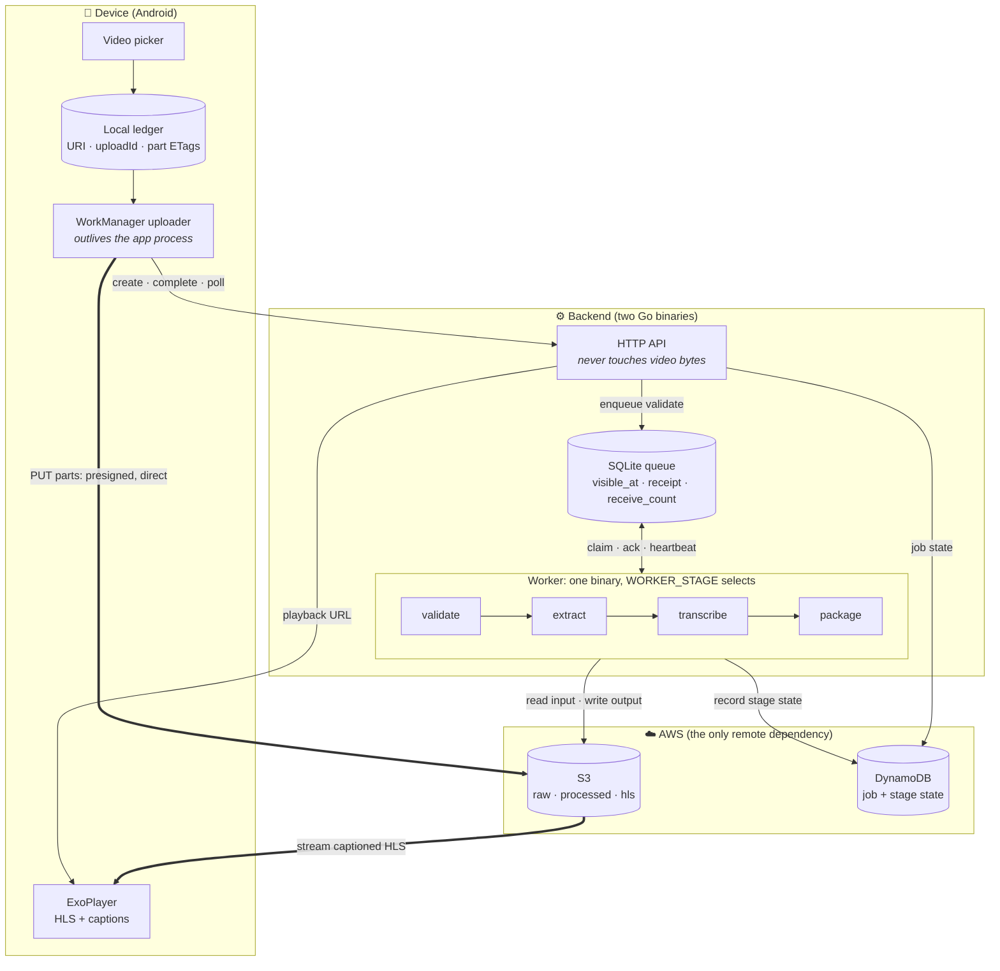

# CaptionClips

**Raw video clip to captioned clips.**

## Demo

<p align="center">
  
</p>

<p align="center">
  <a href="https://github.com/Anshuman11o/Video-Processing-Mobile-App/raw/main/docs/assets/captionclips-demo.mp4">▶ Watch with sound (MP4, 1m51s)</a>
</p>

---

Pick a video on your phone and get back a **captioned, adaptive-bitrate stream**.

Raw clips arrive with no captions and one fixed resolution. CaptionClips uploads
them in resumable 5 MiB parts that survive the app being killed, then runs each
clip through a four-stage backend pipeline — validate, extract the audio,
transcribe it with a speech model, and package the result as HLS. What comes
back is the same footage with **generated captions** and a **three-rung
resolution ladder** the player switches between on the fly.

Uploads and processing run in parallel across clips, and every job reports its
own live progress: which stage it is in, how long each one took, and how many
megabytes have landed.

> **On the name.** The product was called *DayReel* until it was renamed to
> *CaptionClips*. The rename stopped at the product: the Android package id
> (`com.dayreel`), the Go module path (`github.com/anshumanagarwal/dayreel`), the
> S3 buckets (`dayreel-raw-videos`, `dayreel-processed`, `dayreel-hls-output`),
> the DynamoDB table (`dayreel-jobs`), the queue names (`dayreel-validate` and
> friends), the emulator AVD (`dayreel-avd`) and the logcat tag (`DayReelUpload`)
> all still say `dayreel`. They name live infrastructure and shipped code, so
> renaming them in the docs would only send you to resources that do not exist.
> Where you see `dayreel` in a command or an identifier anywhere in this
> repository, it is deliberate and correct.

---

## Contents

- [1. The problem](#1-the-problem)
- [2. The solution](#2-the-solution)
- [3. Architecture](#3-architecture)
  - [3.1 What each component does](#31-what-each-component-does)
  - [3.2 Data flow, end to end](#32-data-flow-end-to-end)
- [4. Queue guarantees, and how each is enforced](#4-queue-guarantees-and-how-each-is-enforced)
- [5. Key features](#5-key-features)
- [6. Technical challenges](#6-technical-challenges)
- [7. What works today](#7-what-works-today)
- [8. Tech stack, and why](#8-tech-stack-and-why)
- [9. Running it](#9-running-it)
- [10. Navigating the repo](#10-navigating-the-repo)

---

## 1. The problem

A raw clip off a phone is a poor thing to publish. It carries **no captions**,
so it is unwatchable on mute and unusable to anyone deaf or hard of hearing —
and most social video is watched on mute. It exists at **exactly one
resolution**, so a viewer on bad data either buffers or gets nothing. Fixing
both means transcription and multi-resolution encoding.

Neither can happen on the phone, and getting the clip off the phone is its own
problem.

**Processing on-device is impractical.** An adaptive-bitrate ladder means
encoding the same clip three times over, and captions mean running a speech
model of several hundred megabytes. That is minutes of sustained CPU on hardware
the user is holding, and both mobile platforms restrict what an app may do once
it leaves the foreground — so the work stops when the user switches away.

**Networks are unreliable and video files are large.** A 60-second 1080p clip
runs to tens of megabytes. On a train, in a lift, or on rural data, a
single-request upload that fails at 90 percent restarts from zero. Users respond
by not uploading.

The naive design — upload in the foreground, process on-device — produces an app
that works only on strong Wi-Fi with the screen open, and asks the user to watch
a progress bar to get there.

---

## 2. The solution

Send the bytes once, reliably, and do the expensive work where it is allowed to
take its time.

**On the device: never lose upload progress.** The clip is divided into 5 MiB
parts, each uploaded independently and recorded to a local ledger as soon as it
succeeds. The transfer is owned by the operating system's scheduler rather than
the app process, so it survives termination and resumes at the first part that
has not landed. Several clips upload at once, and each reports its own progress.

**On the backend: turn one clip into a captioned stream.** Four stages, each
restartable. `validate` checks the file is really playable video and normalises
it; `extract` pulls out a 16 kHz audio track; `transcribe` runs it through
whisper.cpp to produce timed WebVTT cues; `package` encodes the three-rung HLS
ladder and publishes the captions as a selectable subtitle track.

**Make every stage safe to run twice.** Messages carry S3 pointers rather than
payloads, the database holds the only authoritative state, and each stage checks
whether its own output already exists before doing any work. A worker can be
killed mid-encode and the job continues rather than duplicating or dying.

The result takes a clip on a poor connection, finishes the upload whenever the
network allows, and has a captioned, resolution-switchable stream waiting when
the user comes back.

---

## 3. Architecture



The two thick edges are the point: **video bytes never pass through the API.**
The phone talks straight to object storage using short-lived presigned URLs, so a
single small API process can serve uploads of any size.

### 3.1 What each component does

| Component | Responsibility | Why it exists |
|---|---|---|
| **Video picker** | Returns a URI, size and MIME type | Never copies the file; the clip stays in device storage |
| **Local ledger** | Durable record of upload ID and per-part ETags | This *is* the resume mechanism; without it a killed app restarts from zero |
| **WorkManager uploader** | OS-scheduled part upload with constraints and backoff | The app process is not in the loop, so upload survives app death |
| **HTTP API** | Job creation, presigning, completion, status | Coordinator only; it mints URLs and records facts |
| **Queue** | At-least-once hand-off between stages | Decouples stages so any worker can pick up any message |
| **Workers** | ffmpeg and whisper.cpp execution | One binary, four stages; `WORKER_STAGE` selects |
| **S3** | Every video byte and derived artifact | Also supplies the multipart API that makes resume possible |
| **DynamoDB** | Job record with per-stage state | The only source of truth about what has happened |
| **In-process cache** | 1-second TTL on job status (`JOB_CACHE_TTL`) | Absorbs polling bursts. No worker can invalidate it, so the TTL *is* the stage-transition lag |

### 3.2 Data flow, end to end

| # | Actor | Action |
|---|---|---|
| 1 | App → API | `POST /jobs` with filename, size and content type |
| 2 | API → S3 | Create multipart upload, presign one URL per 5 MiB part |
| 3 | API → DynamoDB | Write the job record |
| 4 | App → **S3 directly** | `PUT` each part; checkpoint every ETag to the ledger |
| 5 | App → API | `POST /jobs/{id}/complete`; the part list is optional, derived from `ListParts` when absent |
| 6 | API → Queue | Publish the validate message, **the only thing that starts a pipeline** |
| 7 | Workers | Claim, fetch from S3, process, write output, record state, publish next stage |
| 8 | App → API | Poll `GET /jobs/{id}`, then `GET /jobs/{id}/reel` when complete |
| 9 | S3 → App | Stream `master.m3u8` with adaptive bitrate and captions |

Interrupted at step 4, the app resumes at the first part without an ETag.
Interrupted anywhere in step 7, the lease expires and the message is redelivered.

---

## 4. Queue guarantees, and how each is enforced

Replacing a managed broker with a self-hosted one means the guarantees stop being
configuration and become code. Each row is a property the pipeline depends on,
the mechanism that enforces it, and the reasoning behind both.

| Guarantee | Technique | Why this property, and why this technique |
|---|---|---|
| **At-least-once delivery** | Claiming hides a message rather than removing it. It rejoins the visible set if its lease expires without an acknowledgement. | Exactly-once delivery cannot be built over an unreliable network: an acknowledgement can be lost *after* the work is done, and no protocol can distinguish that from work never done. At-least-once names the ambiguity instead of hiding it, and pushes correctness into idempotence, which is checkable inside a single process. The alternative, at-most-once, silently discards a user's video, which is the one outcome this product cannot tolerate. |
| **Idempotent stages** | Each stage issues a `HeadObject` on its own output key before doing work, and skips straight to publishing if the object is already there. | At-least-once makes repeat execution certain, so every stage must be safe to run twice. The check targets the output *artifact* rather than a "processed" flag, because the artifact is what the next stage consumes: a flag can be set when the upload that mattered never durably landed. One metadata request against a bucket the stage was going to contact anyway is a cheap way to avoid repeating a transcode. |
| **Duplicate distinguished from crash** | Two sources are consulted: presence of the output object, *and* the per-stage record in DynamoDB. | Output present with no recorded state is ambiguous from either source alone. It means either a redelivery after a run that completed, or a crash between writing the output and recording it. Those need opposite handling: skip in the first case, finish the record in the second. Collapsing them into a single boolean makes a correct decision impossible, so the ambiguity is resolved by asking two independent questions instead of trusting one. |
| **One worker per message** | The claim is a single `UPDATE ... WHERE visible_at <= now ... RETURNING` statement. | A read followed by a separate write leaves a window in which two workers select the same row and both proceed. Expressing the claim as one statement delegates mutual exclusion to the storage engine's transaction, which already has to be correct for other reasons. An application-level lock was rejected because a lock held by a process that dies must be reclaimed on a timeout anyway; that means implementing leases regardless, and then maintaining two mechanisms that can disagree. |
| **Recovery from worker death** | The claim writes a future timestamp into `visible_at`, a lease, rather than holding a lock. | A lease expires on its own; a lock needs its holder to release it, and a crashed holder never will. A worker that dies therefore holds nothing and needs no cleanup path. Time-based recovery also avoids a failure detector, a heartbeat quorum and a leader election, none of which are justifiable for a pipeline of this size. |
| **Long stages keep their work** | The worker heartbeats, pushing `visible_at` further out while processing continues. | A single fixed timeout must be either long, which delays recovery from genuine crashes, or short, which redelivers work that is still running. Extension separates the two concerns: the timeout can be tuned for how quickly a crash should be noticed, while slow jobs hold their claim by proving they are alive. Transcription forced this, being the stage whose duration scales with input rather than staying roughly constant. |
| **Late acknowledgements cannot destroy live work** | The claim mints an opaque receipt token. Acknowledgement deletes only if the stored receipt still matches, and returns a distinct lease-lost error when it does not. | A worker that overruns its lease may still finish and try to acknowledge, by which point another worker legitimately owns the message. An unconditional delete would remove a message being actively processed and lose the job with no error raised anywhere. The distinct error matters as much as the check: the overrunning worker has to learn that its result is not authoritative, rather than reporting success. |
| **Poison messages cannot loop forever** | `receive_count` is incremented inside the same claim statement and compared against a delivery budget. | Without a bound, one unprocessable clip occupies a worker indefinitely and starves everything queued behind it. Incrementing during the *claim* rather than on failure means the counter records deliveries, which is the quantity worth bounding: a worker that crashes hard without reporting anything still consumes budget, which is the desired behaviour, because that is precisely the failure a retry will not fix. |
| **Failures stay inspectable** | Dead-lettering is a column transition on the existing row, and the job's failure is written to DynamoDB *before* the message is moved. | A separate physical queue doubles the plumbing for no benefit at this scale; what is actually required is that the message stop being claimable while remaining readable. The write ordering is deliberate: the reverse order allows a crash between the two steps that leaves a job reading `running` forever while its message sits parked, which is the worst state to debug because nothing appears to be broken. |
| **Survives process restart** | SQLite in WAL journal mode, with `synchronous=NORMAL` and a `busy_timeout`. | The queue exists to tolerate process death, so it cannot lose state on process death. WAL is chosen over the default rollback journal because readers do not block the writer, and the access pattern here is several polling readers against occasional writes. `busy_timeout` is needed because multiple processes share one file: without it a contended write returns `SQLITE_BUSY` immediately and surfaces as a spurious error rather than a short wait. |
| **The queue never becomes a data store** | A message is a job ID, a stage name and an S3 key, roughly 300 bytes. Workers fetch the file themselves. | Putting bytes in the message would make throughput a queue problem and tie each stage to whichever worker produced its input. Passing pointers keeps workers stateless, so any replica can handle any message, and keeps message size independent of video size. That independence is what lets the same design hold for a 10-second clip and a 10-minute one. |
| **The guarantees are portable** | One `Queue` interface with SQLite and SQS implementations, selected by `QUEUE_DRIVER`. | The semantics above are the contract the pipeline relies on; the storage engine is not. Keeping them behind an interface forced each one to be stated explicitly rather than inherited from a provider's defaults, which is what made this table writable at all. It also keeps the decision reversible: workers that must run on separate hosts can move to SQS without the pipeline changing. |

---

## 5. Key features

- **Byte-exact upload resume** across app kill, process death and network loss
- **Direct-to-S3 transfer.** The API is never in the data path
- **Four-stage processing pipeline** with per-stage state and failure isolation
- **Pluggable queue.** A self-hosted SQLite broker implementing visibility
  timeouts, delivery counts and dead-lettering in a single file with no server,
  plus real SQS behind the same interface, chosen by one environment variable
- **Adaptive-bitrate HLS** with a three-rung ladder and a selectable caption track
- **Speech-to-text** via whisper.cpp, with a mock mode for fast iteration
- **Idempotent by construction.** Every stage is safe to run twice

---

## 6. Technical challenges

The hard parts of this project were architectural rather than syntactic. Most
were decisions taken, reversed, and taken again as the constraints became clear.

**Deciding where the compute lives.** The first question was whether the device
or the backend does the processing, and it was not obvious. On-device processing
needs no infrastructure, no upload of the original, and no per-minute costs. It
loses on a single constraint: the reel has to be ready when the user next opens
the app, which means the work must happen while the app is dead, and both mobile
platforms strictly limit what a terminated application may do. Once that
constraint is taken seriously the upload becomes the critical path, and the whole
design reorients around never losing upload progress.

**The cloud footprint was cut repeatedly.** A CDN, managed container hosting, an
AWS emulator and a cache server were all planned, and all removed. Each had been
justified by a scale this project does not have. A CDN in front of a handful of
short clips adds a distribution to invalidate and a second access model to reason
about, in exchange for caching that means little when a reel is watched once by
the person who recorded it. Managed container hosting solves worker autoscaling,
which is not a problem at four workers. The discipline that mattered was
recording *why* each was removed, so the reasoning survives the deletion instead
of leaving a future reader to rediscover it.

**Emulating the cloud locally turned out worse than using it.** A local S3
emulator makes development free and offline, which is a real benefit. It also
accepted configuration that real S3 rejects, and served unsigned reads to any
bucket regardless of policy, which left the security model untestable locally
while appearing to work. Provisioning code that set Block Public Access looked
correct against the emulator and proved nothing. Emulator parity is a weaker
guarantee than it appears, and the failures it hides are exactly the ones that
surface in production. The decision was to point development at real AWS and
accept a small bill instead of a false signal.

**Containers stopped paying for themselves.** Docker earned its place when the
stack was six services with an emulator and a cache server among them. Once those
were gone the remaining system was two Go binaries and a file, and the container
layer was providing process isolation nobody needed at the cost of a virtual
machine's worth of memory. The useful part was noticing that the justification
had expired, rather than treating the earlier decision as settled.

**Replacing the managed queue meant owning its failure semantics.** With a hosted
broker, visibility timeouts, delivery counts and redrive policies are
configuration. Self-hosted, they are code that has to be correct: a claim must be
one atomic statement, an acknowledgement must verify the claim is still held, and
a retry budget has to be enforced somewhere. Writing them made the semantics
explicit in a way that merely using them never had. Section 4 is the result.

**At-least-once delivery makes "has this already run?" genuinely ambiguous.**
Output present with no recorded state can mean a duplicate delivery after a run
that succeeded, or a crash in the window between writing the output and recording
it. Those demand opposite responses, and no single flag can tell them apart. This
was the design question that most changed how the pipeline is structured: it is
why stages consult both the object store and the job record, and why every stage
was written to be safe to run twice rather than trying to guarantee it never
would be.

**Background upload could not stay in JavaScript.** Requiring that an upload
survive the app being killed rules out the JavaScript runtime entirely, because
it dies with the app. That pushes the transfer into a platform-native scheduler,
and the cost is a second language, a bridge, and a class of bug where the native
module ships correctly but the JavaScript side cannot resolve it. A
cross-platform framework does not exempt a project from platform-specific work;
it concentrates that work at exactly the points where the platform's guarantees
matter most.

**The mobile dependency surface moved underneath the project.** The document
picker chosen at planning time does not compile against the React Native version
in use, is deprecated, and has no drop-in successor, so the choice had to be
remade mid-build. Mobile dependencies churn faster than backend ones, and naming
a library in a plan written weeks earlier is a weaker commitment than it looks.

**Adaptive streaming needs an access model, not a signed URL.** HLS playlists
reference their segments by relative path, so presigning a master playlist yields
a working playlist whose every segment request returns 403. There is nowhere in
the format to attach a signature. Delivery therefore requires deciding how the
bucket itself is readable, which is a security decision with a blast radius
rather than a URL-generation detail. The opt-in, reversible policy that resolves
it is documented in [`docs/aws-public-hls.md`](docs/aws-public-hls.md), along
with its cost exposure and how to turn it off.

Implementation-level defects, with symptom, cause and fix, are recorded
separately in [`TROUBLESHOOTING.md`](TROUBLESHOOTING.md).

---

## 7. What works today

- Pick a clip, queue it, and upload it in parts that survive app termination
- Resume an interrupted upload, re-issuing URLs only for parts S3 does not hold
- Abort an upload and release the parts S3 is still charging for
- Run the full pipeline: validate, extract, transcribe, package
- Produce a three-rung HLS ladder with a WebVTT caption track
- Play a finished reel in-app with adaptive bitrate switching
- Survive a worker being killed mid-stage without losing or duplicating work
- Dead-letter a poisoned clip after a bounded number of attempts

---

## 8. Tech stack, and why

| Layer | Choice | Reasoning |
|---|---|---|
| Backend | **Go** | Static binaries with no runtime; goroutines match the consume-process-publish shape; first-class AWS SDK |
| Queue | **SQLite** (default) or **Amazon SQS** | A queue is a table with a "hidden until" timestamp. The self-hosted default needs no infrastructure and makes the semantics explicit rather than hiding them behind a service; SQS is selectable via `QUEUE_DRIVER` for when workers must run on more than one machine |
| SQLite driver | **`modernc.org/sqlite`** | Pure Go; a cgo binding will not link in a `CGO_ENABLED=0` static build |
| Storage | **S3** | The multipart API *is* the resume primitive: an upload ID, per-part ETags, and parts that can be retried individually |
| Database | **DynamoDB** | Single-table access by job ID; on-demand billing means idle costs nothing |
| Media | **ffmpeg** | The only realistic option for probing, remuxing and HLS packaging |
| Speech | **whisper.cpp** | Runs locally with no per-minute API cost; a mock mode keeps iteration fast |
| Mobile | **React Native** | One UI codebase, with platform-specific work isolated to the parts that genuinely need it |
| Background upload | **Kotlin + WorkManager** | The OS owns the schedule, so the upload is not tied to the app process. This cannot be done in JavaScript |
| Playback | **react-native-video / ExoPlayer** | Native HLS with adaptive bitrate and caption track selection |

### Why the architecture looks like this

**Why a pipeline instead of one function?** Failure isolation and independent
retry. A transcription failure should not re-run the transcode that already
succeeded, and each stage's output is a checkpoint the next run can skip past.

**Why not process on the device?** The reel has to be ready when the user opens
the app, so the work happens while the app is dead, and both mobile platforms
strictly limit what a terminated app may do.

**Why is S3 not replaceable?** Resumable upload is the product. Rebuilding
multipart semantics (a chunk registry, integrity checking, per-part retry, and
cleanup of abandoned uploads) is the hardest part of the system, and S3 provides
it directly.

---

## 9. Running it

### Prerequisites

| Tool | Notes |
|---|---|
| Go 1.24+ | Backend |
| ffmpeg + ffprobe | Worker stages |
| AWS account | S3 and DynamoDB are real; there is no emulator |
| AWS CLI v2 | Provisioning and verification |
| Node.js 22.13+, JDK 21, Android SDK | Mobile |
| sqlite3 CLI | Optional; for inspecting the queue |

### Setup

```bash
cp .env.example .env      # then fill in credentials and resource names
./scripts/dev-setup.sh    # verifies toolchain, credentials and resources
```

You will need three S3 buckets and one DynamoDB table. Bucket names are globally
unique across all of AWS, so pick your own and put them in `.env`; the table uses
a string partition key `pk` and string sort key `sk`. Full walkthrough in
[`docs/SETUP.md`](docs/SETUP.md).

> **Set a billing alarm before uploading anything.** Thresholds and the exact
> CLI invocation are in [`config/free-tier.md`](config/free-tier.md).

### Run

```bash
make api                  # HTTP API on :8080
make workers              # all four stages
make worker STAGE=extract # or one stage

make queue-peek           # inspect the queue
make queue-reset          # delete it
make test                 # backend test suite
make verify               # check AWS resources exist
```

The queue defaults to the local SQLite file. To run the pipeline on real SQS
instead, create the queues once and set the driver:

```bash
make sqs-setup            # create the five queues (idempotent)
QUEUE_DRIVER=sqs make api
make sqs-teardown         # delete them when finished
```

```bash
cd mobile && npm install && npx react-native run-android
```

The Android emulator reaches the host at `10.0.2.2` rather than `localhost`, so
the app's API base URL points there.

### Configuration

Every setting is documented inline in [`.env.example`](.env.example). Nothing in
this repository contains credentials; `.env` is git-ignored.

---

## 10. Navigating the repo

```
backend/          Go API and workers          → backend/CONTEXT.md
  internal/queue/   Self-hosted queue         → internal/queue/CONTEXT.md
  internal/worker/  Pipeline stages
mobile/           React Native + Kotlin       → mobile/CONTEXT.md
scripts/          Setup and provisioning      → scripts/CONTEXT.md
config/           AWS limits and budget       → config/CONTEXT.md
docs/             Stage plans and setup       → docs/CONTEXT.md
infra/            Deployment (deferred)       → infra/CONTEXT.md
```

**Every directory has a `CONTEXT.md`** explaining what it holds, what each file
does and which decisions are non-obvious. Start there, not in the code.

| Document | What it is |
|---|---|
| [`PROJECT_PLAN.md`](PROJECT_PLAN.md) | Architecture, design invariants, staging, and what was deliberately deferred |
| [`TROUBLESHOOTING.md`](TROUBLESHOOTING.md) | Every non-trivial bug: symptom, cause, fix, prevention |
| [`docs/SETUP.md`](docs/SETUP.md) | Provisioning walkthrough |
| [`docs/METRICS.md`](docs/METRICS.md) | The four project metrics, measured on real AWS — and which two the sample cannot support |
| [`docs/aws-public-hls.md`](docs/aws-public-hls.md) | Why presigning cannot serve HLS, and the opt-in access model — including how to turn it off |
| [`docs/stage-plans/`](docs/stage-plans/) | One plan per stage, written *before* implementation |
| [`config/aws-limits.md`](config/aws-limits.md) | Service constraints the design had to bend around |
| [`config/free-tier.md`](config/free-tier.md) | Budget guardrails and cost traps |

Stage plans are records, not living documents. Superseded ones carry a banner and
are kept in [`docs/stage-plans/superseded/`](docs/stage-plans/superseded/),
including the plans that turned out to be wrong and the reasons why.
