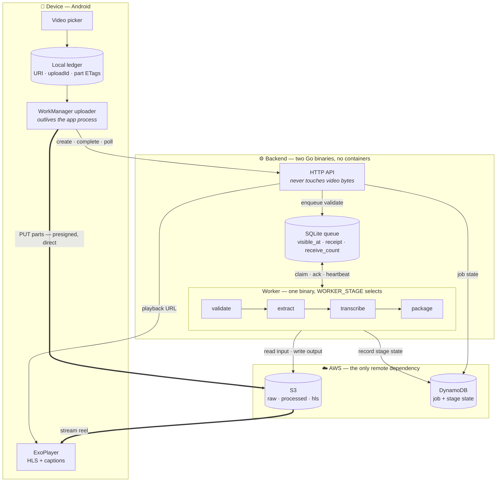

# DayReel

An offline-first mobile video app. Record short clips on a weak network; the app
queues them locally and uploads in the background, resuming **from the exact byte
it stopped at** even after the app is killed. A backend pipeline then validates,
extracts, transcribes and packages each clip into an adaptive-bitrate reel,
waiting the next time you open the app.

---

## Contents

- [1. The problem](#1-the-problem)
- [2. The solution](#2-the-solution)
- [3. Architecture](#3-architecture)
  - [3.1 What each component does](#31-what-each-component-does)
  - [3.2 The distributed-systems parts, in tandem](#32-the-distributed-systems-parts-in-tandem)
  - [3.3 Data flow, end to end](#33-data-flow-end-to-end)
- [4. Key features](#4-key-features)
- [5. Technical challenges](#5-technical-challenges)
- [6. What works today](#6-what-works-today)
- [7. Tech stack, and why](#7-tech-stack-and-why)
- [8. Running it](#8-running-it)
- [9. Navigating the repo](#9-navigating-the-repo)

---

## 1. The problem

Two problems meet in the middle, and each makes the other worse.

**Mobile networks are unreliable, and video is large.** A 60-second 1080p clip is
tens of megabytes. On a train, in a lift, on rural data, a naive upload fails at
90% and starts again from zero. Users respond by not uploading.

**Video processing is too heavy for the device.** Producing an adaptive-bitrate
stream means encoding the same clip three times, plus speech-to-text against a
model of several hundred megabytes. That is minutes of sustained CPU, thermal
throttling and battery drain — on hardware the user is holding. And both mobile
platforms cap what an app may do once the user leaves it, so "process it in the
background" is not a promise the OS lets you keep.

The naive fix — upload in the foreground, process on the device — produces an app
that only works on good Wi-Fi while you stare at a progress bar.

---

## 2. The solution

Split the work at the point where the guarantees change.

**On the device:** never lose upload progress. The clip is cut into 5 MiB parts,
each uploaded independently and checkpointed to a local ledger the instant it
succeeds. The upload is owned by the OS scheduler, not the app process, so it
survives the app being killed and resumes at the first part that has not landed.

**On the backend:** a four-stage pipeline where every stage is stateless and
restartable. Messages carry pointers, never payloads; the database is the only
source of truth; every stage checks whether its own output already exists before
doing any work. A worker can die mid-encode and the job continues.

The result is an app that accepts a clip on a bad connection, finishes the upload
whenever the network allows, and has a finished reel waiting when you return.

---

## 3. Architecture



The two thick edges are the point: **video bytes never pass through the API.**
The phone talks straight to object storage using short-lived presigned URLs, so a
single small API process can serve uploads of any size.

### 3.1 What each component does

| Component | Responsibility | Why it exists |
|---|---|---|
| **Video picker** | Returns a URI, size and MIME type | Never copies the file — the clip stays in device storage |
| **Local ledger** | Durable record of upload ID and per-part ETags | This *is* the resume mechanism; without it a killed app restarts from zero |
| **WorkManager uploader** | OS-scheduled part upload with constraints and backoff | The app process is not in the loop, so upload survives app death |
| **HTTP API** | Job creation, presigning, completion, status | Coordinator only; it mints URLs and records facts |
| **Queue** | At-least-once hand-off between stages | Decouples stages so any worker can pick up any message |
| **Workers** | ffmpeg / whisper.cpp execution | One binary, four stages; `WORKER_STAGE` selects |
| **S3** | Every video byte and derived artifact | Also supplies the multipart API that makes resume possible |
| **DynamoDB** | Job record with per-stage state | The only source of truth about what has happened |
| **In-process cache** | 10-second TTL on job status | Absorbs status polling without a cache server |

### 3.2 The distributed-systems parts, in tandem

These four pieces only make sense together — each covers a failure the others create.

**At-least-once delivery, so idempotency is mandatory.** The queue guarantees a
message is delivered *at least* once, never *exactly* once. So every stage begins
by checking whether its own output object already exists, and consults recorded
stage state to distinguish a duplicate delivery from a crash between uploading
output and recording it. Without this, at-least-once means duplicated work and
racing writes.

**Leases, not locks.** Claiming a message hides it for a visibility timeout
rather than locking it. A worker that dies holds nothing — the lease simply
expires and another worker claims it. Stages slower than the timeout heartbeat to
extend their lease; a stage that overruns anyway loses the message to another
worker, and its late acknowledgement fails with a distinct "lease lost" error
rather than being mistaken for success.

**Retry budgets and dead-lettering, owned by the application.** There is no
broker redrive policy to lean on. The runner classifies failures: permanent ones
(bad codec, corrupt file) dead-letter immediately, transient ones back off and
retry until the budget is spent. The failure is recorded in DynamoDB *before* the
message is dead-lettered, so a job can never sit `running` forever with its
message parked on the dead-letter queue.

**Pointers, not payloads.** A queue message is roughly 300 bytes — a job ID, a
stage name and an S3 key. Workers fetch the file themselves. That is what makes a
worker stateless: it needs nothing from whichever worker ran the previous stage,
so any replica can process any message, and the queue never becomes a data store.

### 3.3 Data flow, end to end

| # | Actor | Action |
|---|---|---|
| 1 | App → API | `POST /jobs` — filename, size, content type |
| 2 | API → S3 | Create multipart upload, presign one URL per 5 MiB part |
| 3 | API → DynamoDB | Write the job record |
| 4 | App → **S3 directly** | `PUT` each part; checkpoint every ETag to the ledger |
| 5 | App → API | `POST /jobs/{id}/complete` — part list optional, derived from `ListParts` when absent |
| 6 | API → Queue | Publish the validate message — **the only thing that starts a pipeline** |
| 7 | Workers | Claim → fetch from S3 → process → write output → record state → publish next stage |
| 8 | App → API | Poll `GET /jobs/{id}`, then `GET /jobs/{id}/reel` when complete |
| 9 | S3 → App | Stream `master.m3u8` with adaptive bitrate and captions |

Interrupted at step 4, the app resumes at the first part without an ETag.
Interrupted anywhere in step 7, the lease expires and the message is redelivered.

---

## 4. Key features

- **Byte-exact upload resume** across app kill, process death and network loss
- **Direct-to-S3 transfer** — the API is never in the data path
- **Four-stage processing pipeline** with per-stage state and failure isolation
- **Self-hosted queue** implementing SQS's semantics — visibility timeouts,
  delivery counts, dead-letter queues — in a single file with no server
- **Adaptive-bitrate HLS** with a three-rung ladder and a selectable caption track
- **Speech-to-text** via whisper.cpp, with a mock mode for fast iteration
- **Idempotent by construction** — every stage is safe to run twice
- **Zero containers locally** — two Go binaries and a file

---

## 5. Technical challenges

**Presigned URLs are bound to a hostname.** SigV4 signs the `Host` header, so a
URL presigned for one address cannot be string-replaced to another — the
signature breaks. An API and a phone that reach storage under different names
need the URL signed for the address the *uploader* will use, not the one the
signer uses. This is invisible until the first upload from a real device.

**Emulator parity is a trap, not a safety net.** An S3 emulator accepted a
wildcard in a CORS `ExposeHeaders` rule that real S3 rejects outright with
`InvalidRequest`. The class of bug is worse than the instance: local success
proves nothing about a service that only enforces the rule in production.

**S3's 5 MiB part floor fails late.** Parts below the minimum upload happily,
returning `200` each time, and the job fails at `CompleteMultipartUpload` with
`EntityTooSmall` — after every part has apparently succeeded. The part size is
therefore clamped in config rather than merely validated.

**Writing a queue means writing the failure semantics.** Using SQS, visibility
timeouts and redrive policies are configuration. Self-hosted, they are code: a
message claim must be a single atomic statement, because a read followed by a
separate write lets two workers claim the same job in the gap between them.
Acknowledgement must verify the claim is still held, or a worker whose lease
expired will delete a message another worker is actively processing.

**Distinguishing a duplicate from a crash.** At-least-once delivery makes "did
this already run?" ambiguous — output present with no recorded state could mean a
duplicate delivery, or a crash between uploading output and recording it. The two
need different handling, so both the object and the stage state are consulted.

**HLS cannot be delivered by presigning.** Playlists reference their segments by
relative path, so a presigned master playlist yields `403` on every segment the
player then requests. Adaptive streaming needs an access model, not a signed URL
— and the emulator hid this too, by serving unsigned reads to any bucket. The
opt-in, reversible bucket policy that resolves it, its blast radius and its
teardown are documented in [`docs/aws-public-hls.md`](docs/aws-public-hls.md).

Each of these is written up with symptom, cause and fix in
[`TROUBLESHOOTING.md`](TROUBLESHOOTING.md).

---

## 6. What works today

- Pick a clip, queue it, and upload it in parts that survive app termination
- Resume an interrupted upload, re-issuing URLs only for parts S3 does not hold
- Abort an upload and release the parts S3 is still charging for
- Run the full pipeline: validate → extract → transcribe → package
- Produce a three-rung HLS ladder with a WebVTT caption track
- Play a finished reel in-app with adaptive bitrate switching
- Survive a worker being killed mid-stage without losing or duplicating work
- Dead-letter a poisoned clip after a bounded number of attempts
- Run the entire backend with no Docker, no emulator and no cache server

---

## 7. Tech stack, and why

| Layer | Choice | Reasoning |
|---|---|---|
| Backend | **Go** | Static binaries with no runtime; goroutines match the consume-process-publish shape; first-class AWS SDK |
| Queue | **SQLite** | A queue is a table with a "hidden until" timestamp. Zero infrastructure, single file, and the semantics are explicit rather than hidden behind a service |
| SQLite driver | **`modernc.org/sqlite`** | Pure Go — a cgo binding will not link in a `CGO_ENABLED=0` static build |
| Storage | **S3** | The multipart API *is* the resume primitive: an upload ID, per-part ETags, and parts that can be retried individually |
| Database | **DynamoDB** | Single-table access by job ID; on-demand billing means idle costs nothing |
| Media | **ffmpeg** | The only realistic option for probing, remuxing and HLS packaging |
| Speech | **whisper.cpp** | Runs locally with no per-minute API cost; a mock mode keeps iteration fast |
| Mobile | **React Native** | One UI codebase; the platform-specific work is isolated to the parts that need it |
| Background upload | **Kotlin + WorkManager** | The OS owns the schedule, so the upload is not tied to the app process — this cannot be done in JavaScript |
| Playback | **react-native-video / ExoPlayer** | Native HLS with adaptive bitrate and caption track selection |

### Why the architecture looks like this

**Why a pipeline instead of one function?** Failure isolation and independent
retry. A transcription failure should not re-run the transcode that already
succeeded, and each stage's output is a checkpoint the next run can skip past.

**Why not process on the device?** The reel has to be ready when the user opens
the app, which means the work happens while the app is dead — and both mobile
platforms strictly limit what a terminated app may do.

**Why is S3 not replaceable?** Resumable upload is the product. Rebuilding
multipart semantics — chunk registry, integrity, retry, cleanup of abandoned
uploads — is the hardest part of the system, and S3 provides it directly.

**Why was so much removed?** A CDN, managed container hosting, an AWS emulator
and a cache server were all planned and all cut. At a handful of short clips they
cost ~1.5–2.5 GB of local RAM and bought nothing. The rationale for each removal
is recorded in [`PROJECT_PLAN.md`](PROJECT_PLAN.md) rather than lost to git
history.

---

## 8. Running it

### Prerequisites

| Tool | Notes |
|---|---|
| Go 1.24+ | Backend |
| ffmpeg + ffprobe | Worker stages |
| AWS account | S3 and DynamoDB are real; there is no emulator |
| AWS CLI v2 | Provisioning and verification |
| Node.js 22.11+, JDK 17, Android SDK | Mobile |
| sqlite3 CLI | Optional — for inspecting the queue |

### Setup

```bash
cp .env.example .env      # then fill in credentials and resource names
./scripts/dev-setup.sh    # verifies toolchain, credentials and resources
```

You will need three S3 buckets and one DynamoDB table. Bucket names are globally
unique across all of AWS, so pick your own and put them in `.env`; the table uses
a string partition key `pk` and string sort key `sk`. Full walkthrough in
[`docs/SETUP.md`](docs/SETUP.md).

> **Set a billing alarm before uploading anything.** Thresholds and the exact
> CLI invocation are in [`config/free-tier.md`](config/free-tier.md).

### Run

```bash
make api                  # HTTP API on :8080
make workers              # all four stages
make worker STAGE=extract # or one stage

make queue-peek           # inspect the queue
make queue-reset          # delete it
make test                 # backend test suite
make verify               # check AWS resources exist
```

```bash
cd mobile && npm install && npx react-native run-android
```

The Android emulator reaches the host at `10.0.2.2`, not `localhost` — point the
app's API base URL there.

### Configuration

Every setting is documented inline in [`.env.example`](.env.example). Nothing in
this repository contains credentials; `.env` is git-ignored.

---

## 9. Navigating the repo

```
backend/          Go API and workers          → backend/CONTEXT.md
  internal/queue/   Self-hosted queue         → internal/queue/CONTEXT.md
  internal/worker/  Pipeline stages
mobile/           React Native + Kotlin       → mobile/CONTEXT.md
scripts/          Setup and provisioning      → scripts/CONTEXT.md
config/           AWS limits and budget       → config/CONTEXT.md
docs/             Stage plans and setup       → docs/CONTEXT.md
infra/            Deployment (deferred)       → infra/CONTEXT.md
```

**Every directory has a `CONTEXT.md`** explaining what it holds, what each file
does and which decisions are non-obvious. Start there, not in the code.

| Document | What it is |
|---|---|
| [`PROJECT_PLAN.md`](PROJECT_PLAN.md) | Architecture, design invariants, staging, and what was deliberately deferred |
| [`TROUBLESHOOTING.md`](TROUBLESHOOTING.md) | Every non-trivial bug: symptom, cause, fix, prevention |
| [`docs/SETUP.md`](docs/SETUP.md) | Provisioning walkthrough |
| [`docs/aws-public-hls.md`](docs/aws-public-hls.md) | Why presigning cannot serve HLS, and the opt-in access model — including how to turn it off |
| [`docs/stage-plans/`](docs/stage-plans/) | One plan per stage, written *before* implementation |
| [`config/aws-limits.md`](config/aws-limits.md) | Service constraints the design had to bend around |
| [`config/free-tier.md`](config/free-tier.md) | Budget guardrails and cost traps |

Stage plans are records, not living documents. Superseded ones carry a banner and
are kept in [`docs/stage-plans/superseded/`](docs/stage-plans/superseded/) —
including the plans that were wrong, and why.
